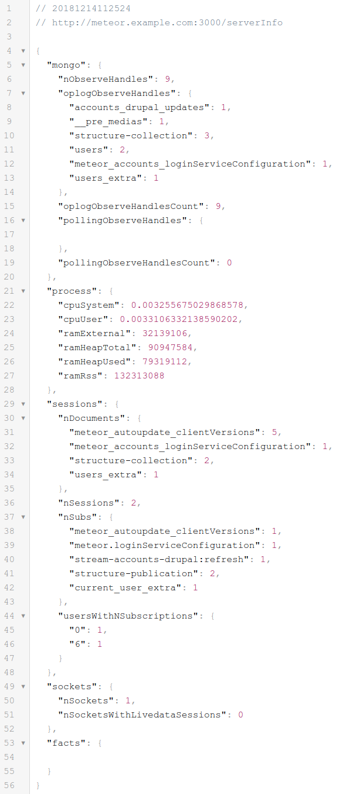

# Meteor server info

- A NPM version (derivative work) of [percolate:server-info]
- Rewritten in TypeScript 3 for Meteor 1.6-1.8
- Without the AWS-specific and extra sections, not relevant for most usages.
- With 3 original Node.JS EventLoop metrics collectors (see "Configuration")

[](https://travis-ci.org/fgm/meteor_server_info)
[](https://codecov.io/gh/fgm/meteor_server_info)
[](https://snyk.io/test/github/fgm/meteor_server_info?targetFile=package.json)

## Usage

Once installed and configured, the package provides

- a public metrics documentation route, available by default on
  `/serverInfo/doc` where all exposed metrics are documented
- a metrics values route available with HTTP Basic authentication, by
  default on `/serverInfo`, like the following one:




## Installation

- Like the original version, this project needs the MDG [Facts] package, but not
the `facts-ui`package. So from the project directory, add both dependencies:
```
meteor add facts
meteor yarn add meteor_server_info
```
- Then, in the main JS file of the server part of the application, add code to
  initialize the package:

```
import { ServerInfo } from "meteor_server_info";

Meteor.startup(function () {
  const serverInfo = new ServerInfo(Meteor, WebApp, MongoInternals, Facts);
  serverInfo.register();
});
```

- Edit the Meteor settings, at least to change the user and password.
- Run your application normally.

### Development installation

To work on the package, you will probably not want to use it via NPM/Yarn. In
that case:

- do NOT add it to your `package.json`
- clone it in the `import/server/` directory of your project,
- import its dependencies with `yarn`
- build documentation with `yarn && yarn doc`. The documentation will be built
  in the `out/` directory.
- compile with `yarn ts-compile`, lint with `yarn ts-lint` and run tests with
  `yarn test-ci`

To use your development version of the module, import it locally in your
application code. You will have access to `serverInfo` from `meteor shell`.

```
// Heed the "./" import.
import { ServerInfo } from "./meteor_server_info";

Meteor.startup(function () {
  const serverInfo = new ServerInfo(Meteor, WebApp, MongoInternals, Facts);
  serverInfo.register();
  global.serverInfo = serverInfo;
});
```

That way, any time you recompile the module, you application will notice the JS
changes and rebuild/restart itself.


## Configuration

The packages takes configuration from `Meteor.settings`, in which it uses the
following server keys:

- `path`: the path on which the information is made available. Defaults to
  `/serverInfo`, unlike the original version which defaulted to `/info`.
- `user`: the user account for the HTTP Basic authentication securing access.
  Defaults to `insecure`.
- `pass`: the password for the user account. Defaults to `secureme`.
- `verbose`: enable console logging. Defaults to `false`.
- `eventLoopStrategy`: the strategy to use to instrument the event loop and CPU
  - `"cheap"`: similar to [PM2] or [pebble/event-loop-lag]; low CPU cost : expect
    around 0.5% on 2019 hardware,
    very limited accuracy, will usually under-estimate the actual loop latency.
  - `"costly"`: inspired by a [Dynatrace article], a much more accurate strategy,
    tracing each tick of the event loop ; this is much also more costly since
    it disables the event loop "poll phase wait" optimization: expect 5% load.
  - `"nr"`: inspired by NewRelic "CPU time per tick", a more intuitive metric,
    built on top of the `costly` algorithm, with a small extra: expect 6% load.
  - `false`, the event loop metrics collection is disabled, to keep costs at an
    absolute minimum like the legacy `MeteorServerInfo`.

[pebble/event-loop-lag]: https://github.com/pebble/event-loop-lag
[percolate:server-info]: https://atmospherejs.com/percolate/server-info
[PM2]: https://github.com/keymetrics/pmx/blob/1.3/lib/default_probes/pacemaker.js
[Facts]: https://atmospherejs.com/meteor/facts
[screenshot]: screenshot-todos.png
[Dynatrace article]: https://medium.com/the-node-js-collection/what-you-should-know-to-really-understand-the-node-js-event-loop-and-its-metrics-c4907b19da4c


## Usage note

Metrics exposed by the module can easily be imported to Grafana using the `http`
plugin and a Telegraf import. Be sure to import data from all your Meteor server
instances, since metrics are reported per-server, not per-database.

Note that since the `costly` and `nr` strategies disable the event loop poll
phase wait optimization, the idle ticks/second rate will be around 900 and go
lower with increased load. There is a tradeoff to be done: CPU cost vs accuracy.

The high cost of these strategies is a consequence of the limitations of the
Node.JS event loop JavaScript API, requiring workarounds. For accurate metrics
with lower metric acquisition cost, a binary agent is required: AppDynamics,
Dynatrace, NewRelic and others offer this type of solution, the tradeoff in
that case being CPU cost vs monthly SaaS cost.


## License

As the original [percolate:server-info] package was licensed under the
permissive MIT license, this derivative work has been relicensed under the
General Public License version 3 or later (SPDX: GPL-3.0+).


## Changelog

* 1.2.5
  * Native event loop metrics from package [event-loop-stats](https://github.com/bripkens/event-loop-stats)
    as a more efficient alternative to the userland Counter classes.
* 1.2.4
  * Same as 1.2.3, but also working on Meteor 1.8.1
  * Session info are no longer null on Meteor 1.8.1
  * Socket metrics also work in `meteor run` mode on Meteor 1.8.1 
* 1.2.3
  * New garbage collector metrics from package [gc-stats](https://github.com/dainis/node-gcstats).
  * TypeScript 3.4.
* 1.2.2
  * New tickLagMax in NrCounter. Other metrics renamed and reworded for intelligibility.
  * TypeScript 3.3.
  * Over 70% new test coverage for NrCounter and CounterBase.
* 1.2.1
  * Node.JS EventLoop and CPU metrics, 3 strategies at different accuracy and cost levels
  * TypeScript 3.2.
  * Documentation converted from Jsdoc to Typedoc.
  * 100% test coverage of NodeInfo and SessionInfo.
* 1.2.0
  * Converted to TypeScript 3, with increased coverage
  * Compatibility with Meteor 1.7 and 1.8.
* 1.1.2
  * updated documentation.
  * Travis CI tests.
  * CodeCov coverage analysis.
* 1.1.1
  * include RAM / CPU metrics.
* 1.0.1
  * added an explicit dev dependency on marked 0.3.9 to work around
    https://github.com/jsdoc3/jsdoc/issues/1489 - can be removed once jsdoc
    updates its dependency to that level.
  * updated JsDoc to 3.5.5.
  * fixed JsDoc configuration so that npm run doc actually works
* 1.0.0: initial version
  * For Meteor 1.6.x
